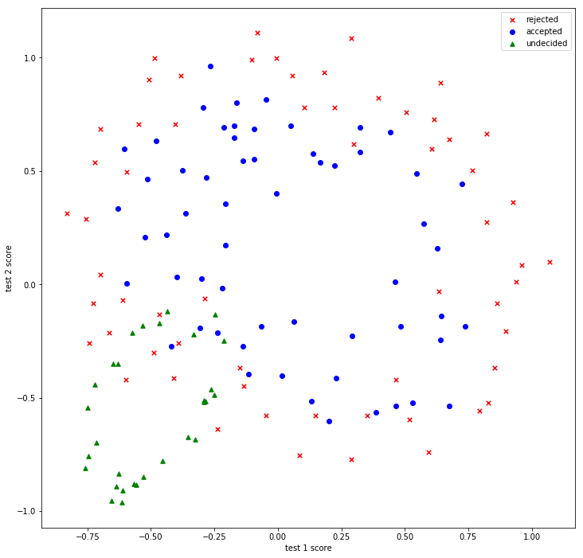

# Microchip-Quality-Assurance

Suppose you are the product manager of a microchip factory, and you are in charge of the quality assurance (QA). During QA, each microchip goes through two tests. From the two test results, you would like to determine whether the microchips should be accepted, rejected or undecided (require more tests). To help you make the decision, you have a dataset of test results on past microchips, from which you can build classifiers for your future decisions. Test results from past microchips are scatter plotted as below.

### Two class Classification 
<b>*1. Logistic Regression Classifier for the first two classes rejected and accepted (C = 10)*</b>
- *Accuracy for training data: 52%*
- *Accuracy for test data: <b>31%</b>*

<table style="width:100%">
  <caption><b>Confusion Matrix</b></caption>
  <tr>
    <th></th>
    <th>Predicted Class = 0</th>
    <th>Predicted Class = 1</th>
  </tr>
  <tr>
    <td><b>Actual Class = 0</b></td>
    <td>11</td>
    <td>7</td>
  </tr>
  <tr>
    <td><b>Actual Class = 1</b></td>
    <td>24</td>
    <td>3</td>
  </tr>
</table>

<b>Precision: *30%*</b> 
<b>Recall: *11%*</b> 
<b>F1-Score: *16%*</b>

<b>Result</b>:Logistic Regression classifier performed poor, because data was not scattered in a linearly separable way, hence, the hyperplane of logistic regression model was not be able properly separate two classes.
    
<b>*2. Gaussian naïve Bayes classifier for the first two classes rejected and accepted*</b>
- *Accuracy for training data: 75%*
- *Accuracy for test data: <b>69%</b>*

<table style="width:100%">
  <caption><b>Confusion Matrix</b></caption>
  <tr>
    <th></th>
    <th>Predicted Class = 0</th>
    <th>Predicted Class = 1</th>
  </tr>
  <tr>
    <td><b>Actual Class = 0</b></td>
    <td>14</td>
    <td>4</td>
  </tr>
  <tr>
    <td><b>Actual Class = 1</b></td>
    <td>10</td>
    <td>17</td>
  </tr>
</table>

<b>Precision: *81%*</b> 
<b>Recall: *63%*</b> 
<b>F1-Score: *71%*</b>

<b>Result</b>:Gaussian Naive Bayes model outperformed Logistic Regression model, because Gaussian Naive Bayes:
- working well with small data
- decision boundary is presented by piecewise quadratic function which better match given data
- assumes the features to be conditionally independent (correlation between data variables: -0.13)
    

<b>*3. Applying SVM kernel idea to Logistic Regression model</b>*

In order to improve the performance of Logisitic Regression model, polynomial degrees were introduced that maps the data to higher dimensional space where the hyperplane of the Logistic regression can separate classes better.

<table style="width:100%">
  <caption><b>4-degree Polynomial degree Confusion Matrix</b></caption>
  <tr>
    <th></th>
    <th>Predicted Class = 0</th>
    <th>Predicted Class = 1</th>
  </tr>
  <tr>
    <td><b>Actual Class = 0</b></td>
    <td>16</td>
    <td>2</td>
  </tr>
  <tr>
    <td><b>Actual Class = 1</b></td>
    <td>6</td>
    <td>21</td>
  </tr>
</table>

<b>Accuracy for test data(score): *82%*</b> 
<b>Precision: *91%*</b> 
<b>Recall: *78%*</b> 
<b>F1-Score: *84%*</b>
  
After mapping the data to higher dimension, the hyperplane divided classes pretty well. The best Score, Precision and Recall values are obtained by using 4-degree polynomial with complexity 10 (C= 10) where we have the least number of False Positives(2) and False Negatives(6). 
However, increasing the dimension of data is making the model to overfit, hence, we need to consider the complexity adjustment to avoid overfitting.

It is clear from the plot that by increasing the inverse lambda (Lambda=1/C) we are making the model to overfit.
First plot shows underfitting while the last one represent the overfitting of the model.
    
### Three class Classification 
<b>*4. Multi-class Logistic Regression model using Softmax function</b>*

<table style="width:100%">
  <caption><b>4-degree Polynomial degree Confusion Matrix</b></caption>
  <tr>
    <th></th>
    <th>Predicted Class = 0</th>
    <th>Predicted Class = 1</th>
    <th>Predicted Class = 2</th>
  </tr>
  <tr>
    <td><b>Actual Class = 0</b></td>
    <td>11</td>
    <td>4</td>
    <td>3</td>
  </tr>
  <tr>
    <td><b>Actual Class = 1</b></td>
    <td>24</td>
    <td>3</td>
    <td>0</td>
  </tr>
    <tr>
    <td><b>Actual Class = 2</b></td>
    <td>1</td>
    <td>2</td>
    <td>12</td>
  </tr>
</table>

<table style="width:100%">
  <caption><b>4-degree Polynomial degree Confusion Matrix</b></caption>
  <tr>
    <th>Class</th>
    <th>Precision</th>
    <th>Recall</th>
    <th>F1-Score</th>
    <th>Support</th>
  </tr>
  <tr>
    <td><b>0</b></td>
    <td>0.31</td>
    <td>0.61</td>
    <td>0.41</td>
    <td>18</td>
  </tr>
   <tr>
    <td><b>1</b></td>
    <td>0.33</td>
    <td>0.11</td>
    <td>0.17</td>
    <td>27</td>
  </tr>
    <tr>
    <td><b>2</b></td>
    <td>0.80</td>
    <td>0.80</td>
    <td>0.80</td>
    <td>15</td>
  </tr>
    <tr>
    <td><b>Avg/Total</b></td>
    <td>0.44</td>
    <td>0.43</td>
    <td>0.40</td>
    <td>60</td>
  </tr>
  
</table>

<b>Accuracy for test data(score): *43%*</b> 
<b>Precision: *44%*</b> 
<b>Recall: *43%*</b> 
<b>F1-Score: *40%*</b>
  

All three scores (Precision, Recall and F-1 Score) are improved from Logistic Regression binary classification to Logistic Regression multi-class classification. Because the third class (undecided) that we included in multi-class model is easily separable by decision boundary of the Logistic Regression the overall scores are improved. From the Confusion Matrix of multi-class classification it is visible that True Positives for third class is quite high which make all scores to be biased.
  
F1 score is the harmonic mean of precision and recall, so F1 score should fall between the precision score and recall score. Because we are applying *weighted F1-score* which calculated F1-score for each class and find their average by support can make F1-score not to fall betweeen Precision and Recall. 
<b>Weighted F1-Score: 40%</b>

